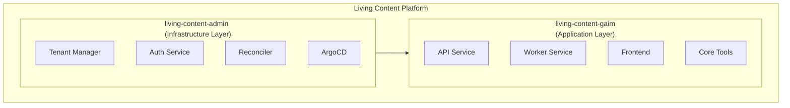

# Living Content Platform Architecture

> "I think the problem, to be quite honest with you, is that you've never
> actually known what the question is." — Deep Thought

A comprehensive architectural reference for the Living Content multi-tenant AI
infrastructure platform.

## Quick Navigation

| Document                                        | Description                                             |
| ----------------------------------------------- | ------------------------------------------------------- |
| [Platform Overview](platform-overview.md)       | High-level architecture and component relationships     |
| [Infrastructure Layer](infrastructure-layer.md) | `living-content-admin` - Platform management components |
| [Application Layer](application-layer.md)       | `living-content-gaim` - Runtime services and tools      |
| [Multi-Tenancy](multi-tenancy.md)               | Tenancy model, namespaces, and isolation                |
| [Data Stores](data-stores.md)                   | Firestore, MongoDB, and LanceDB schemas                 |
| [Networking](networking.md)                     | DNS patterns, load balancing, and traffic flow          |
| [Authentication](authentication.md)             | Auth layers, flows, and session management              |
| [Observability](observability.md)               | Metrics, resilience patterns, and monitoring            |

## Platform Summary

Living Content is a **GitOps-driven multi-tenant AI infrastructure platform**
built on Google Cloud Platform, consisting of two primary codebases:

## Key Characteristics

- **GitOps-First**: All infrastructure changes flow through Git → ArgoCD
- **Multi-Tenant**: Namespace-based isolation with RBAC enforcement
- **Event-Driven**: Redis Streams for async task processing
- **RAG-Enabled**: Vector-based knowledge retrieval and tool selection
- **Streaming**: Real-time WebSocket communication

## Repositories

| Repository                        | Purpose                                         |
| --------------------------------- | ----------------------------------------------- |
| `living-content-admin`            | Platform CLI, Tenant Manager, platform services |
| `living-content-gaim`             | GAIM runtime: API, Worker, Frontend, Core tools |
| `living-content-gitops-templates` | Jinja2 Kubernetes resource templates            |
| `living-content-gitops`           | Generated Kubernetes manifests (ArgoCD source)  |

## CLI Tools

| CLI         | Purpose             | Key Commands                                           |
| ----------- | ------------------- | ------------------------------------------------------ |
| `lco-admin` | Platform management | `tenant create`, `gaim create`, `gcp cluster create`   |
| `lco-gaim`  | GAIM operations     | `config get/set`, `env local/remote`, `docker up/down` |
