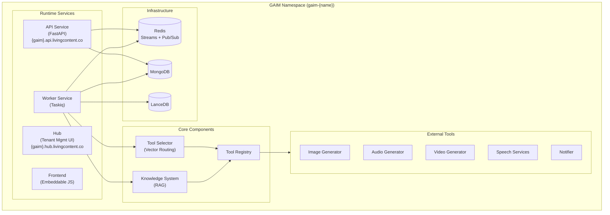
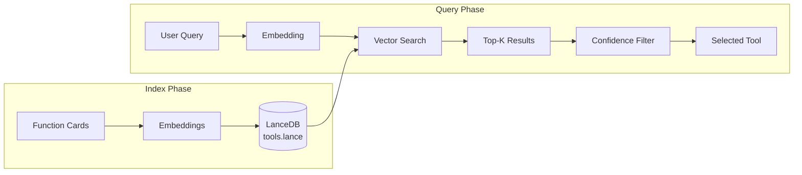
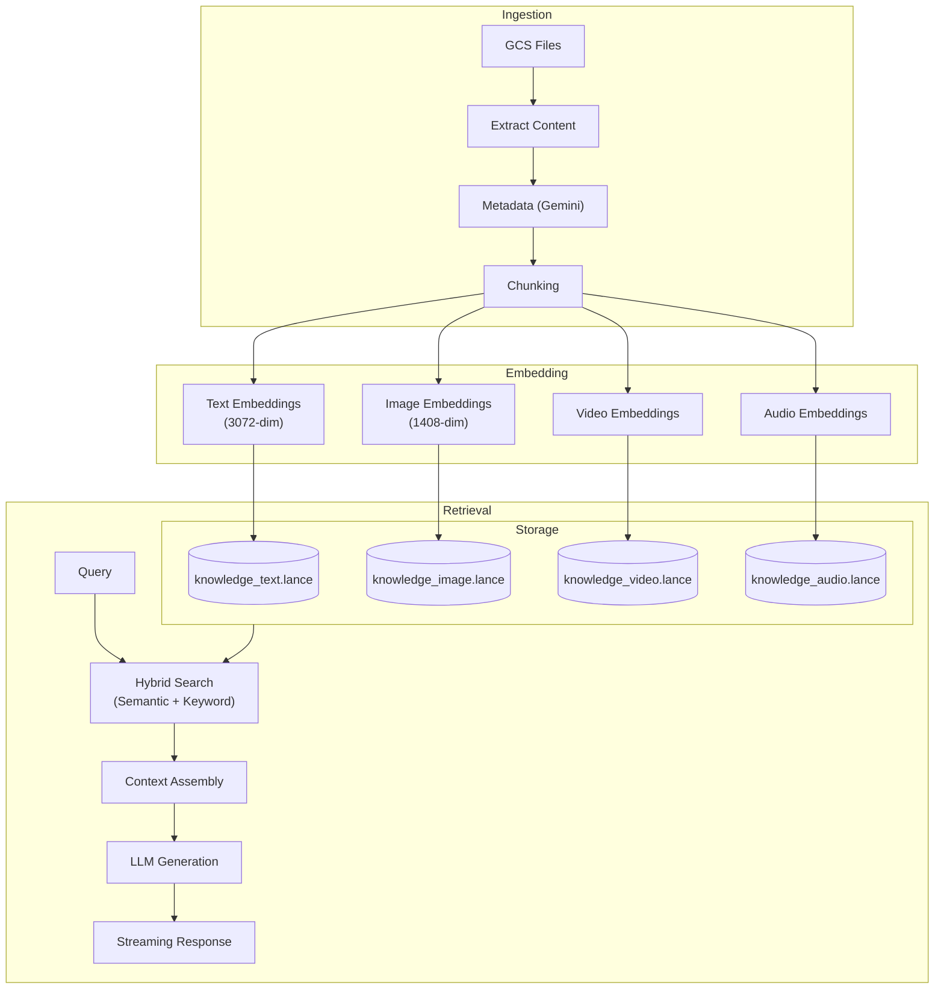
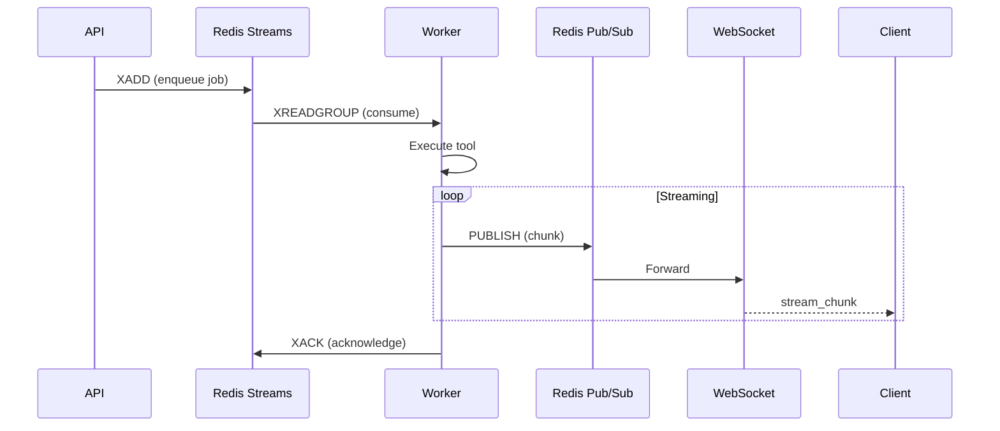
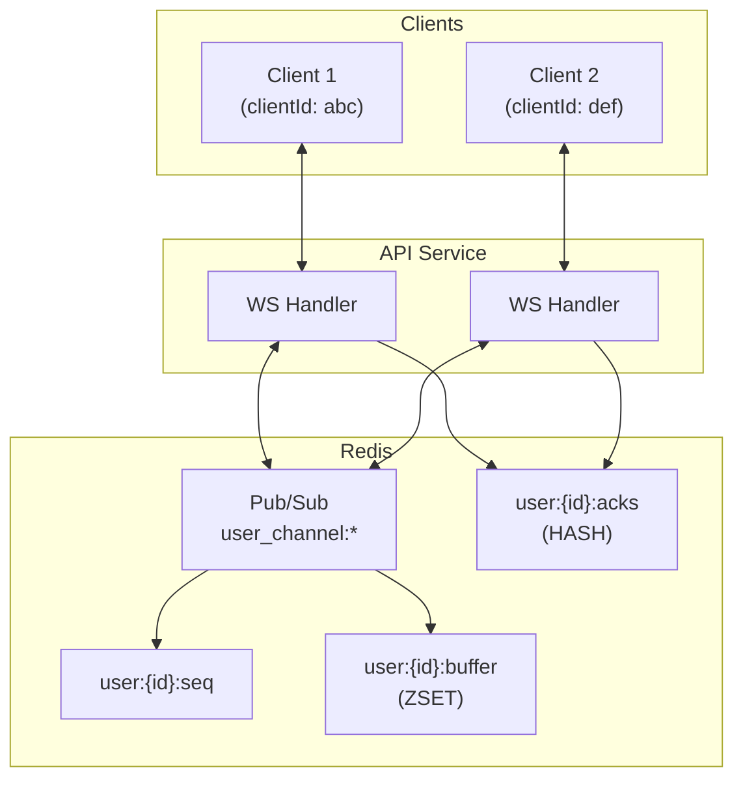
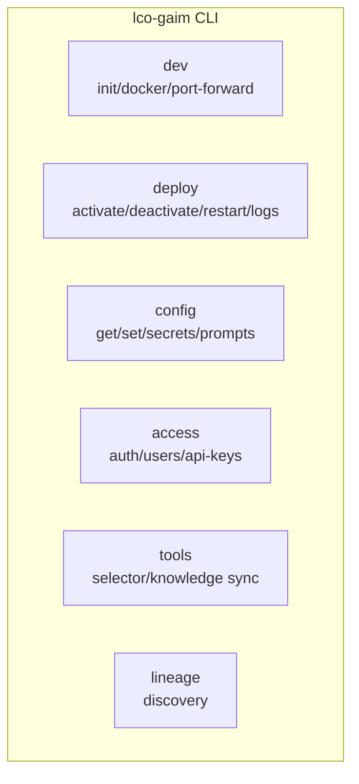

# Application Layer (living-content-gaim)

The application layer provides the GAIM (Generative AI Manager) runtime,
delivering intelligent tool routing, RAG-based knowledge management, and
real-time streaming responses.

## Service Architecture



## Runtime Services

### API Service (FastAPI)

HTTP server handling requests and enqueuing background jobs.

| Property      | Value                         |
| ------------- | ----------------------------- |
| **Domain**    | `{gaim}.api.livingcontent.co` |
| **Framework** | FastAPI                       |
| **Scaling**   | Horizontal (HPA)              |

**Responsibilities:**

- HTTP routing and request handling
- Token validation and authentication
- Job enqueueing to Redis Streams
- WebSocket connection management
- Configuration management

**Middleware Stack (Request Order):**

1. `InitializationMiddleware` - App readiness check
2. `AuthMiddleware` - Token validation
3. `RateLimitMiddleware` - User + IP rate limiting
4. `SecurityHeadersMiddleware` - CSP, X-Frame-Options
5. `MetricsMiddleware` - Request timing
6. `CustomCORSMiddleware` - CORS handling

### Worker Service (Taskiq)

Background job processor using Redis Streams.

| Property      | Value                  |
| ------------- | ---------------------- |
| **Framework** | Taskiq + Redis Streams |
| **Scaling**   | Horizontal (HPA)       |

**Responsibilities:**

- Query processing with tool selection
- Tool execution and streaming
- Result delivery via Redis Pub/Sub
- Lineage manifest building
- Notification delivery

**Task Types:**

| Task                     | Purpose            |
| ------------------------ | ------------------ |
| `process_query`          | Query processing   |
| `deliver_notification`   | WebSocket delivery |
| `build_lineage_manifest` | EQTY manifest      |

### Hub (Tenant Management)

Management interface for tenants to configure and manage their GAIMs. Includes
both a web UI and CLI.

| Property          | Value                                        |
| ----------------- | -------------------------------------------- |
| **Web UI Domain** | `{gaim}.hub.livingcontent.co`                |
| **CLI**           | `lco-gaim`                                   |
| **Framework**     | Vanilla JS (custom event-based architecture) |
| **Runtime**       | GKE Deployment (web), Local (CLI)            |

### Frontend (Embeddable)

User-facing UI that interfaces with the GAIM API. Embeddable on any customer
site.

| Property         | Value                                                         |
| ---------------- | ------------------------------------------------------------- |
| **Framework**    | Vanilla JS (custom event-based architecture)                  |
| **Deployment**   | Embeddable JS file (deployable on any site)                   |
| **Distribution** | CDN-hosted                                                    |
| **Alternative**  | Pipeline deployments can bypass FE and call GAIM API directly |

## Core Components

### Tool Selector

Vector-based intelligent tool routing using semantic embeddings.



**Configuration:** `tools.selector.*`

| Parameter          | Default                  | Description                  |
| ------------------ | ------------------------ | ---------------------------- |
| `enabled`          | `true`                   | Enable tool selection        |
| `embed_model`      | `text-embedding-3-small` | Embedding model              |
| `top_k`            | `6`                      | Candidates to retrieve       |
| `accept_threshold` | `0.70`                   | Minimum confidence           |
| `margin_threshold` | `0.12`                   | Required margin vs runner-up |

### Knowledge System

RAG-based knowledge management with multi-modal support.



**Configuration:** `tools.knowledge.*`

| Parameter                 | Description                  |
| ------------------------- | ---------------------------- |
| `enabled`                 | Enable knowledge system      |
| `reindex`                 | `"auto"`, `false`, or `true` |
| `embeddings.embed_text`   | Text embedding config        |
| `embeddings.embed_images` | Image embedding config       |
| `embeddings.embed_video`  | Video embedding config       |
| `embeddings.embed_audio`  | Audio embedding config       |

### Tool Registry

Central registry managing core components and external tools.

**Structure:**

```plaintext
shared/core/tools/{name}/
├── __init__.py       # Optional preload() function
├── functions.py      # {Name}Functions class
├── models.py         # Pydantic models
├── router.py         # Optional FastAPI router
└── providers/        # Implementation details
```

## External Tools

| Tool                | Purpose               | Provider            |
| ------------------- | --------------------- | ------------------- |
| **Image Generator** | AI image generation   | Midjourney/APIFRAME |
| **Audio Generator** | Audio style transfers | JEN                 |
| **Video Generator** | Video generation      | Various             |
| **Speech Services** | TTS & speech-to-text  | ElevenLabs/OpenAI   |
| **Notifier**        | Welcome notifications | Internal            |

## Task Queue Architecture

### Redis Streams



**Environment Isolation:**

| Environment | Stream Name        | Consumer Group       |
| ----------- | ------------------ | -------------------- |
| Local dev   | `gaim:tasks`       | `gaim:workers`       |
| K8S stage   | `gaim:tasks:stage` | `gaim:workers:stage` |
| K8S prod    | `gaim:tasks:prod`  | `gaim:workers:prod`  |

### Task Module Structure

```plaintext
shared/core/tasks/
├── broker.py              # RedisStreamBroker config
├── dependencies.py        # Shared task dependencies
├── query.py              # Query processing task
├── notification.py       # Notification delivery
├── lineage.py           # Lineage manifest building
├── cancellation.py      # Cooperative cancellation
├── backpressure.py      # Queue depth monitoring
└── middleware/
    ├── dlq.py           # Dead letter queue
    └── metrics.py       # Prometheus metrics
```

## WebSocket Architecture



**Message Types:**

| Type              | Durability | Description              |
| ----------------- | ---------- | ------------------------ |
| `stream_chunk`    | Ephemeral  | Streaming response chunk |
| `stream_complete` | Ephemeral  | Stream completion        |
| `result`          | Ephemeral  | Final result             |
| `status`          | Ephemeral  | Status update            |
| `notification`    | Durable    | Persistent notification  |
| `ping`            | Ephemeral  | Keepalive                |

**Protocol:**

- Client → Server: `auth` (connect), `ack` (acknowledgment)
- Server → Client: `notification`, `ping`, response messages

## CLI Tool (lco-gaim)



**GAIM Lifecycle:**

| Command                              | Purpose                                  |
| ------------------------------------ | ---------------------------------------- |
| `lco-gaim dev init --gaim-name NAME` | Initialize GAIM locally                  |
| `lco-gaim info`                      | Check GAIM status                        |
| `lco-gaim deploy activate`           | Scale up (requires tool selector on NFS) |
| `lco-gaim deploy deactivate`         | Scale down to 0 replicas                 |

**Other Commands:**

| Command                            | Purpose                |
| ---------------------------------- | ---------------------- |
| `lco-gaim config get [KEY]`        | Get config value       |
| `lco-gaim config set KEY VALUE`    | Set config override    |
| `lco-gaim config prompts edit KEY` | Edit prompt in $EDITOR |
| `lco-gaim dev docker up`           | Start local containers |
| `lco-gaim dev docker down`         | Stop local containers  |

## Source Code Structure

```plaintext
living-content-gaim/
├── shared/                    # Shared package (gaim-core) - query path only
│   └── core/
│       ├── clients/           # Database clients
│       ├── config/            # Configuration
│       ├── execution/         # Query execution
│       ├── managers/          # Connection management
│       ├── models/            # Data models
│       ├── streams/           # Redis Streams
│       ├── tasks/             # Taskiq tasks
│       ├── tools/             # Tool implementations (retrieval only)
│       │   └── knowledge/
│       │       ├── retrieval/ # Query execution
│       │       ├── schemas/   # Schema definitions
│       │       └── storage/   # LanceDB access
│       └── utils/             # Utilities
│
├── api/                       # API Service
│   └── app/
│       ├── routers/           # HTTP endpoints
│       ├── middleware/        # Request processing
│       └── main.py            # FastAPI app
│
├── worker/                    # Worker Service
│   └── app/
│       └── main.py            # Taskiq app
│
├── hub/                       # CLI tool and index building
│   └── app/
│       ├── interfaces/cli/    # Click commands
│       ├── services/          # Business logic
│       └── tools/             # Index building pipeline
│           └── knowledge/
│               ├── ingestion/ # PDF processing, chunking
│               └── services/  # OCR, multimodal (easyocr, pymupdf)
│
├── fe/                        # Frontend (Vanilla JS, event-based)
│
└── documentation/             # Project docs
```

**Architecture Notes:**

- **shared** contains query/retrieval path only - lightweight, no heavy ML deps
- **hub** contains index building pipeline with heavy dependencies (easyocr,
  pymupdf)
- API and Worker depend on shared; they never import hub code

## API Endpoints

### Authentication

| Endpoint         | Method | Description        |
| ---------------- | ------ | ------------------ |
| `/auth/whoami`   | GET    | Current user info  |
| `/auth/check`    | GET    | Quick auth status  |
| `/auth/exchange` | POST   | Auth code exchange |

### Content Sessions

| Endpoint                 | Method | Description    |
| ------------------------ | ------ | -------------- |
| `/content-sessions`      | POST   | Create session |
| `/content-sessions`      | GET    | List sessions  |
| `/content-sessions/{id}` | GET    | Get session    |
| `/content-sessions/{id}` | PUT    | Update session |
| `/content-sessions/{id}` | DELETE | Delete session |

### Queries

| Endpoint        | Method | Description      |
| --------------- | ------ | ---------------- |
| `/queries`      | POST   | Submit query     |
| `/queries/{id}` | GET    | Get query status |
| `/queries/{id}` | DELETE | Cancel query     |

### System

| Endpoint        | Method        | Description        |
| --------------- | ------------- | ------------------ |
| `/system/queue` | GET           | Queue health       |
| `/config`       | GET/PUT/PATCH | Configuration      |
| `/metrics`      | GET           | Prometheus metrics |
| `/health`       | GET           | Health check       |

## Related Documentation

- [Platform Overview](platform-overview.md) - High-level architecture
- [Data Stores](data-stores.md) - Database schemas
- [Authentication](authentication.md) - Auth implementation
- [Observability](observability.md) - Metrics and resilience
