# Authentication

Living Content implements a multi-layer authentication system with a central
auth service, GAIM-scoped access, and anonymous session support.

## Authentication Architecture

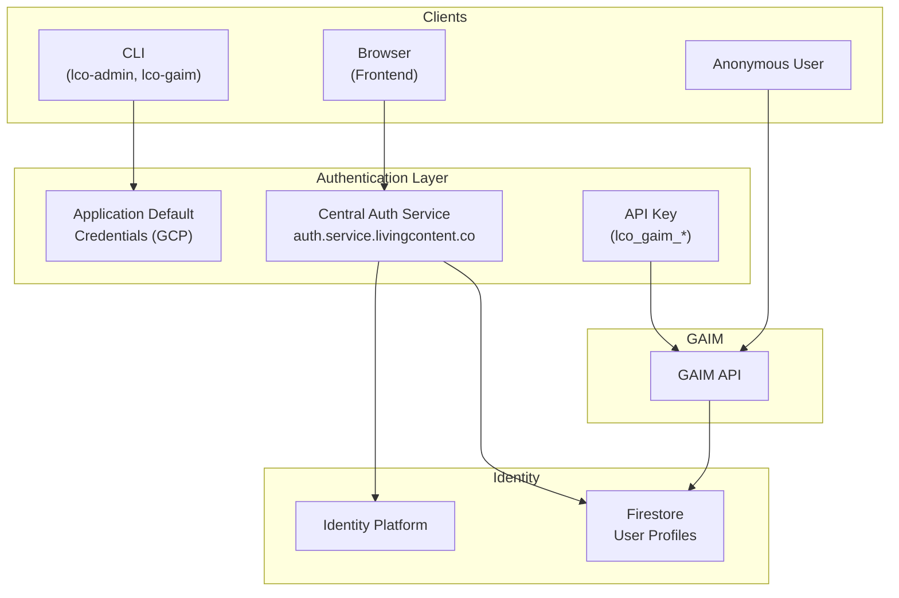

## Authentication Layers

| Layer              | Method               | Used By                 | Purpose             |
| ------------------ | -------------------- | ----------------------- | ------------------- |
| Platform CLI       | ADC (gcloud)         | `lco-admin`, `lco-gaim` | Admin operations    |
| Service-to-Service | API Key              | GAIM → TM               | Machine operations  |
| Frontend Users     | Central Auth Service | Browsers                | User authentication |
| Anonymous          | Server-generated ID  | Unauthenticated         | Trial access        |

## Central Auth Service

Single authentication endpoint for all frontend users.

### Sign-In Methods

All authentication is handled server-side via backend redirects. No client-side
JavaScript SDK is required.

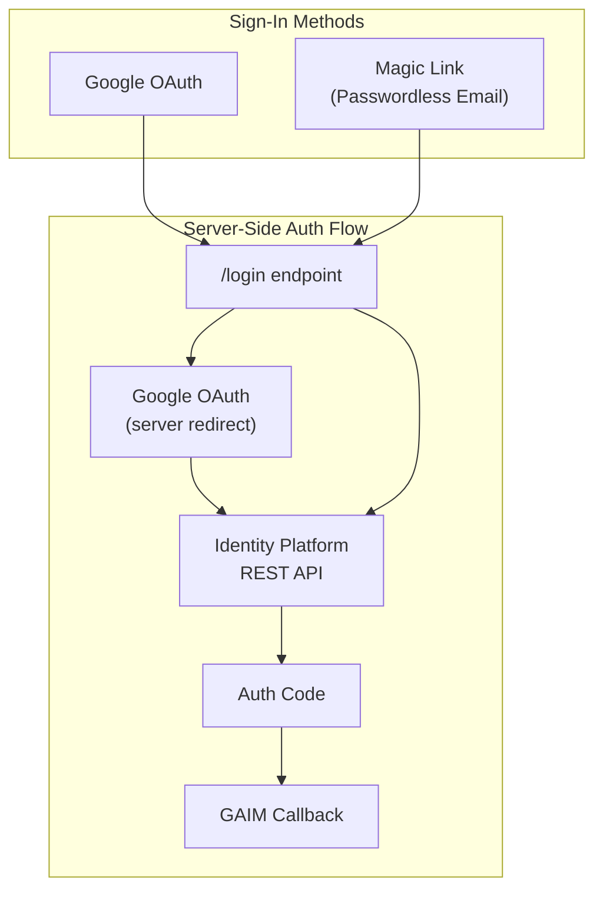

| Method       | Description                |
| ------------ | -------------------------- |
| Magic Link   | Passwordless email sign-in |
| Google OAuth | Google account sign-in     |

### Authentication Flow

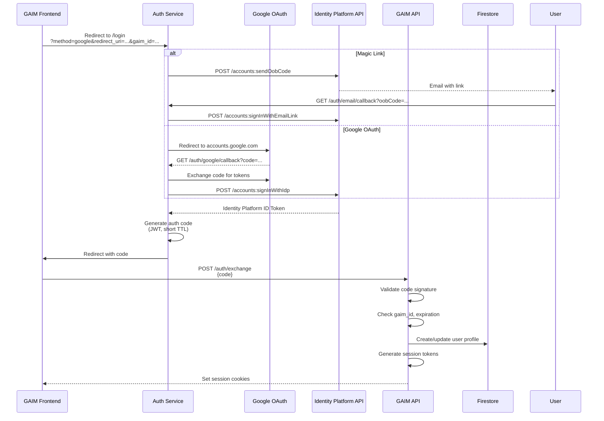

## Token Types

### Auth Code

Short-lived JWT for secure token exchange.

| Property | Value                               |
| -------- | ----------------------------------- |
| Format   | JWT                                 |
| TTL      | Short-lived                         |
| Usage    | One-time                            |
| Contents | `id_token`, `gaim_id`, `jti`, `exp` |

### Identity Platform ID Token

Google-signed JWT containing user identity.

| Property | Value                                      |
| -------- | ------------------------------------------ |
| Format   | JWT (RS256)                                |
| Issuer   | `https://securetoken.google.com/{project}` |
| TTL      | Standard (Identity Platform default)       |
| Contents | `uid`, `email`, `name`, `picture`          |

### API Key

Machine-to-machine authentication for service calls.

| Property | Value                 |
| -------- | --------------------- |
| Format   | `lco_gaim_{random}`   |
| Length   | 48+ characters        |
| Usage    | GAIM → Tenant Manager |

## Session Management

### Session Cookies

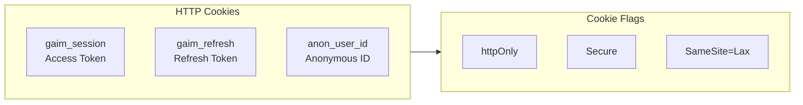

| Cookie      | Contents        | Purpose            |
| ----------- | --------------- | ------------------ |
| `{session}` | GAIM-signed JWT | Access token       |
| `{refresh}` | Opaque token ID | Refresh token      |
| `{anon}`    | Signed anon ID  | Anonymous identity |

### Token Refresh

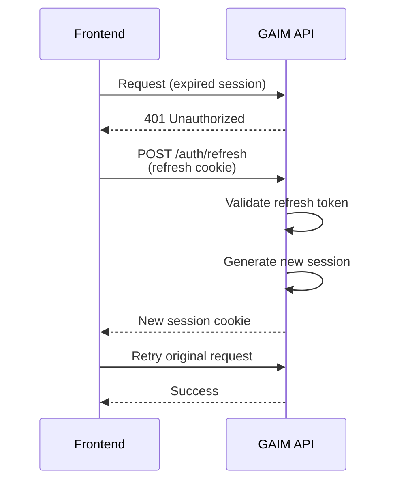

## Anonymous Access

Server-generated identity for unauthenticated users.

### Anonymous ID Format

```plaintext
anon-{uuid}
```

Example: `anon-550e8400-e29b-41d4-a716-446655440000`

### Anonymous Flow

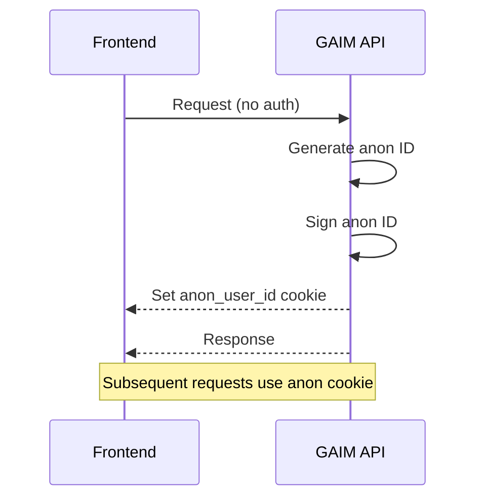

### Session Migration

Convert anonymous session to authenticated session.

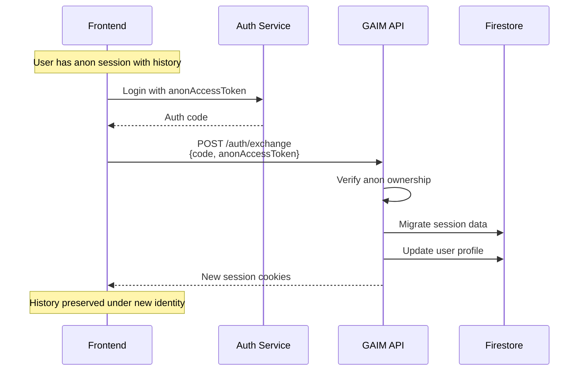

## User Roles

Per-GAIM role-based access control.

| Role     | Permissions                           |
| -------- | ------------------------------------- |
| `admin`  | Full GAIM management, user management |
| `editor` | Modify content, manage sessions       |
| `viewer` | Read-only access                      |
| `user`   | Standard end-user access              |

### Role Hierarchy

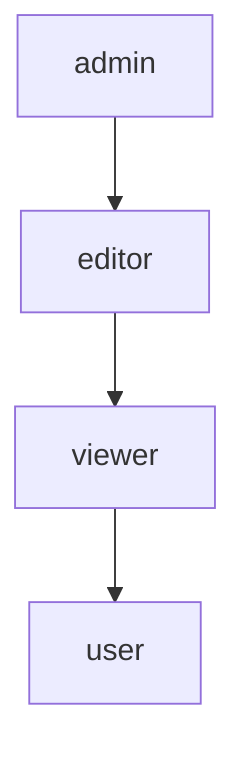

## Firestore User Schema

Path: `gaims/{gaim_id}/users/{uid}`

```json
{
  "uid": "dent42",
  "email": "arthur@heartofgold.ship",
  "name": "Arthur Dent",
  "picture": "https://guide.galaxy/arthur.jpg",
  "role": "editor",
  "created_at": "2024-01-17T08:00:00Z",
  "last_active": "2024-01-22T16:30:00Z"
}
```

## Secrets Management

### Infrastructure Credentials

Fetched at container startup by init container.

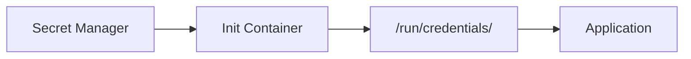

| Secret           | Path                       | Purpose      |
| ---------------- | -------------------------- | ------------ |
| Redis password   | `/run/credentials/{redis}` | Redis auth   |
| MongoDB password | `/run/credentials/{mongo}` | MongoDB auth |

### Auth Service Secrets

The central auth service uses these secrets from Secret Manager:

| Secret                  | Purpose                           |
| ----------------------- | --------------------------------- |
| `{signing-key}`         | JWT signing for auth codes        |
| `{identity-api-key}`    | Identity Platform REST API access |
| `{oauth-client-id}`     | Google OAuth client ID            |
| `{oauth-client-secret}` | Google OAuth client secret        |

### Application Secrets

Loaded at runtime from Firestore with envelope encryption.

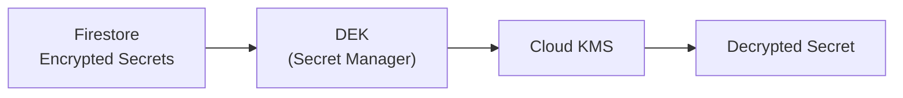

| Feature        | Description          |
| -------------- | -------------------- |
| Encryption     | Fernet (symmetric)   |
| Key Storage    | Secret Manager (DEK) |
| Key Protection | Cloud KMS            |
| Hot Reload     | Yes (async runtime)  |

## CLI Authentication

### Application Default Credentials

```bash
# Authenticate CLI
gcloud auth application-default login

# CLI uses ADC automatically
lco-admin tenant list
lco-gaim config get
```

### API Key Generation

```bash
# Generate GAIM API key
lco-admin gaim token create --gaim-name=marvin

# Output: lco_gaim_xxxxxxxxxxxxxxxxxxxxxxxxxxxx
```

## Middleware Stack

Request processing order in GAIM API:

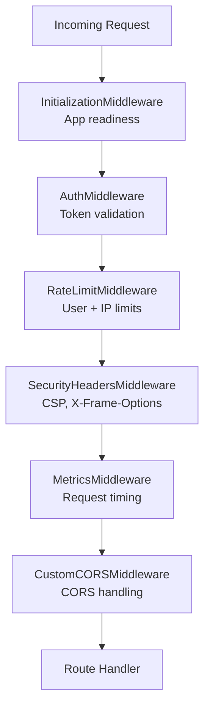

## Rate Limiting

Per-endpoint limits enforced at middleware layer. Limits vary by endpoint
sensitivity.

## Related Documentation

- [Platform Overview](platform-overview.md) - Architecture context
- [Infrastructure Layer](infrastructure-layer.md) - Auth Service details
- [Application Layer](application-layer.md) - GAIM auth endpoints
- [Networking](networking.md) - Auth routing
