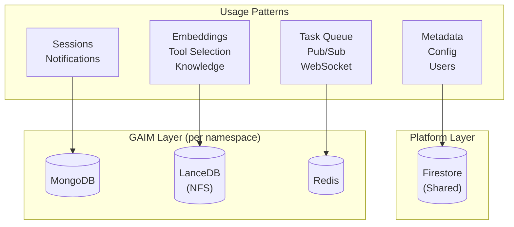
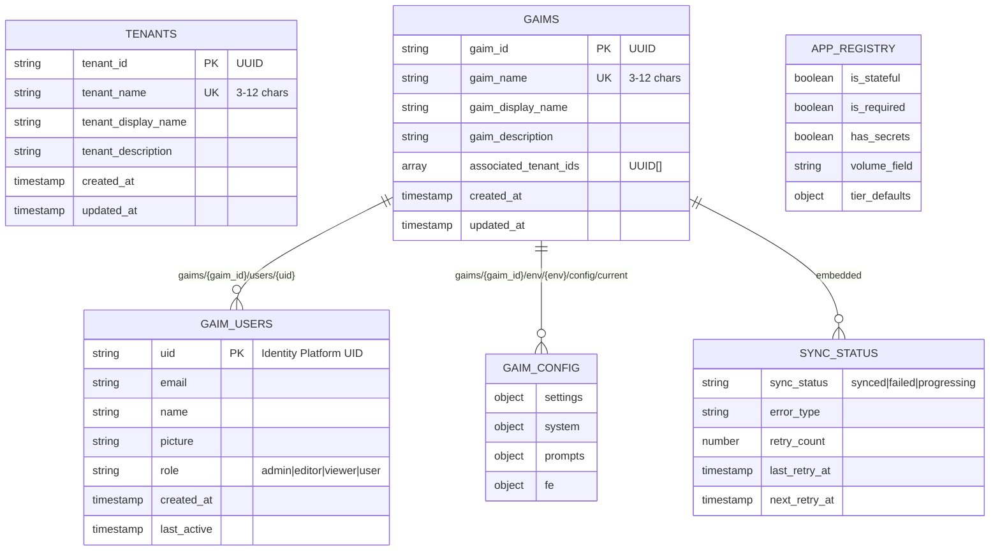
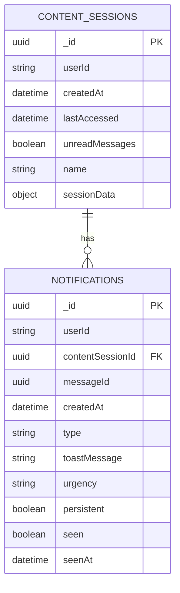
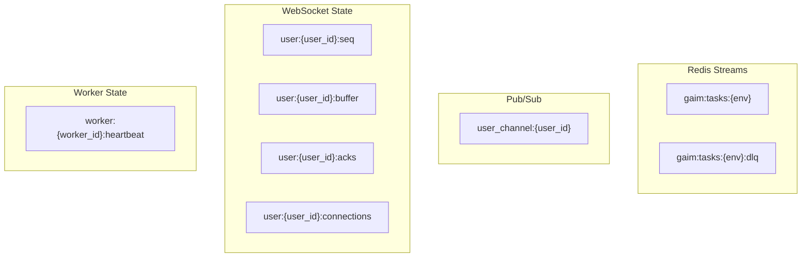
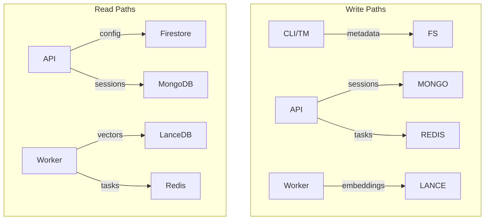

# Data Stores

Living Content uses multiple data stores optimized for different access
patterns: Firestore for metadata/config, MongoDB for application data, LanceDB
for vector embeddings, and Redis for messaging.

## Data Store Overview



## Firestore

Shared NoSQL database for platform metadata, configuration, and user profiles.

### Collections Schema



### Collection Paths

| Collection   | Path                                       | Purpose                     |
| ------------ | ------------------------------------------ | --------------------------- |
| Tenants      | `tenants/{tenant_id}`                      | Tenant metadata             |
| GAIMs        | `gaims/{gaim_id}`                          | GAIM metadata + sync status |
| Users        | `gaims/{gaim_id}/users/{uid}`              | Per-GAIM user profiles      |
| Config       | `gaims/{gaim_id}/env/{env}/config/current` | Runtime configuration       |
| App Registry | `tenant_manager/config/apps/{app_name}`    | App type definitions        |

### Tenant Document

```json
{
  "tenant_id": "550e8400-e29b-41d4-a716-446655440000",
  "tenant_name": "siriuscorp",
  "tenant_display_name": "Sirius Cybernetics Corporation",
  "tenant_description": "Share and Enjoy",
  "created_at": "2024-01-15T10:30:00Z",
  "updated_at": "2024-01-20T14:22:00Z"
}
```

### GAIM Document

```json
{
  "gaim_id": "660e8400-e29b-41d4-a716-446655440001",
  "gaim_name": "marvin",
  "gaim_display_name": "Marvin the Paranoid Android",
  "gaim_description": "Brain the size of a planet",
  "associated_tenant_ids": ["550e8400-e29b-41d4-a716-446655440000"],
  "sync_status": "synced",
  "error_type": null,
  "retry_count": 0,
  "created_at": "2024-01-16T09:00:00Z",
  "updated_at": "2024-01-21T11:45:00Z"
}
```

### User Profile Document

Path: `gaims/{gaim_id}/users/{uid}`

```json
{
  "uid": "dent42",
  "email": "arthur@heartofgold.ship",
  "name": "Arthur Dent",
  "picture": "https://guide.galaxy/arthur.jpg",
  "role": "editor",
  "created_at": "2024-01-17T08:00:00Z",
  "last_active": "2024-01-22T16:30:00Z"
}
```

### Configuration Document

Path: `gaims/{gaim_id}/env/{env}/config/current`

```json
{
  "settings": {
    "llm_clients": {
      "vertex_ai": { "enabled": true },
      "claude": { "enabled": false },
      "openai": { "enabled": true }
    },
    "tools": {
      "knowledge": { "enabled": true, "reindex": "auto" },
      "image_generator": { "enabled": true }
    }
  },
  "system": {
    "lineage": { "enabled": true },
    "ingress": { "rate_limit": 100 }
  },
  "prompts": {
    "persona": "You are a helpful AI assistant..."
  },
  "fe": {
    "theme": "light",
    "features": { "voice_input": true }
  }
}
```

## MongoDB

Per-GAIM document database for application data.

### Database Naming

| Environment | Database Name    |
| ----------- | ---------------- |
| Stage       | `lco-gaim-stage` |
| Production  | `lco-gaim-prod`  |

### MongoDB Collections Schema



### Content Session Document

```json
{
  "_id": "770e8400-e29b-41d4-a716-446655440002",
  "userId": "dent42",
  "createdAt": "2024-01-22T10:00:00Z",
  "lastAccessed": "2024-01-22T16:45:00Z",
  "unreadMessages": false,
  "name": "Mostly Harmless",
  "sessionData": {
    "preferences": {
      "theme": "dark",
      "language": "en"
    },
    "context": {
      "project_id": "earth-42"
    }
  }
}
```

### Notification Document

```json
{
  "_id": "880e8400-e29b-41d4-a716-446655440003",
  "userId": "dent42",
  "contentSessionId": "770e8400-e29b-41d4-a716-446655440002",
  "messageId": "990e8400-e29b-41d4-a716-446655440004",
  "createdAt": "2024-01-22T16:30:00Z",
  "type": "message",
  "toastMessage": "New response available",
  "urgency": "normal",
  "persistent": true,
  "seen": false,
  "seenAt": null
}
```

## LanceDB

Per-GAIM vector database for embeddings, stored on Filestore NFS.

### Storage Paths

| Table           | Path                                             | Purpose                 |
| --------------- | ------------------------------------------------ | ----------------------- |
| Tool Selector   | `/data/{env}/tool_selector/tools.lance`          | Tool routing embeddings |
| Text Knowledge  | `/data/{env}/knowledge/knowledge_text.lance`     | Text embeddings         |
| Image Knowledge | `/data/{env}/knowledge/knowledge_image.lance`    | Image embeddings        |
| Video Knowledge | `/data/{env}/knowledge/knowledge_video.lance`    | Video embeddings        |
| Audio Knowledge | `/data/{env}/knowledge/knowledge_audio.lance`    | Audio embeddings        |
| Metadata        | `/data/{env}/knowledge/metadata/{filename}.json` | Source metadata         |

### Embedding Dimensions

| Content Type | Model                     | Dimensions |
| ------------ | ------------------------- | ---------- |
| Text         | `gemini-embedding-001`    | 3072       |
| Images       | `multimodalembedding@001` | 1408       |
| Video        | Various                   | Variable   |
| Audio        | Various                   | Variable   |

### Tool Selector Schema

```json
{
  "tool_id": "knowledge_query",
  "function_name": "search_knowledge_base",
  "description": "Search the knowledge base for relevant information",
  "embedding": [0.123, -0.456, ...],
  "created_at": "2024-01-20T12:00:00Z"
}
```

### Knowledge Text Schema

```json
{
  "chunk_id": "doc-123-chunk-5",
  "source": "guide_entry_earth.pdf",
  "content": "Earth: Mostly harmless...",
  "embedding": [0.234, -0.567, ...],
  "metadata": {
    "subject": "planetary",
    "type": "guide_entry",
    "content_date": "2024-01-15"
  }
}
```

### Metadata Schema

```json
{
  "source": "guide_entry_earth.pdf",
  "subject": "planetary",
  "type": "guide_entry",
  "tags": ["earth", "harmless", "guide"],
  "summary": "Guide entry for planet Earth",
  "content_date": "2024-01-15",
  "content_type": "application/pdf",
  "gcs_path": "gs://bucket/guide/guide_entry_earth.pdf",
  "filename": "guide_entry_earth.pdf",
  "indexed_at": "2024-01-20T14:30:00Z"
}
```

## Redis

Per-GAIM cache and messaging infrastructure.

### Key Schema



### Key Patterns

| Pattern                        | Type         | Purpose                  |
| ------------------------------ | ------------ | ------------------------ |
| `gaim:tasks:{env}`             | Stream       | Task queue               |
| `gaim:tasks:{env}:dlq`         | Stream       | Dead letter queue        |
| `user:{user_id}:seq`           | String       | Message sequence counter |
| `user:{user_id}:buffer`        | ZSET         | Message buffer (by seq)  |
| `user:{user_id}:acks`          | Hash         | Client acknowledgments   |
| `user:{user_id}:connections`   | Set          | Worker registrations     |
| `worker:{worker_id}:heartbeat` | String (TTL) | Worker health            |

### Environment Isolation

| Environment | Stream             | Consumer Group       |
| ----------- | ------------------ | -------------------- |
| Local       | `gaim:tasks`       | `gaim:workers`       |
| Stage       | `gaim:tasks:stage` | `gaim:workers:stage` |
| Production  | `gaim:tasks:prod`  | `gaim:workers:prod`  |

### Task Message Format

```json
{
  "task_name": "process_query",
  "task_id": "task-123",
  "args": {
    "query_id": "query-456",
    "user_id": "dent42",
    "content": "What is the revenue for Q4?"
  },
  "enqueued_at": "2024-01-22T16:30:00Z"
}
```

### Dead Letter Queue Entry

```json
{
  "task_name": "process_query",
  "task_id": "task-123",
  "args": { ... },
  "error": "Tool execution timeout",
  "timestamp": "2024-01-22T16:35:00Z",
  "retry_count": 3
}
```

## Data Flow Summary



## Related Documentation

- [Platform Overview](platform-overview.md) - Architecture context
- [Application Layer](application-layer.md) - Service access patterns
- [Multi-Tenancy](multi-tenancy.md) - Data isolation
- [Observability](observability.md) - Data store metrics
