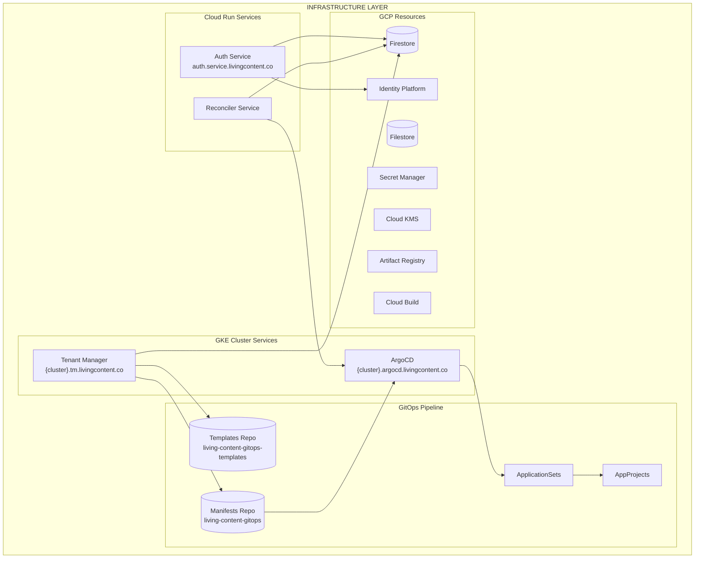
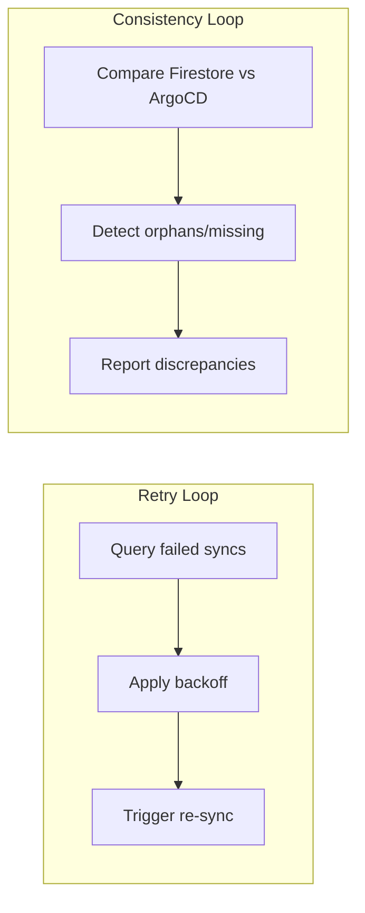
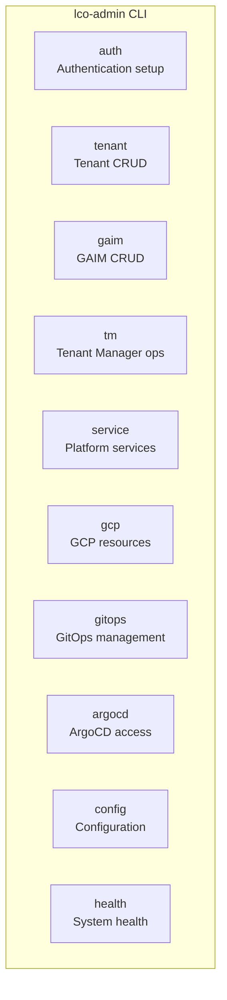

# Infrastructure Layer (living-content-admin)

The infrastructure layer manages platform-level resources, tenant lifecycle, and
GitOps deployment pipelines.

## Component Architecture



## Platform Services (Cloud Run)

### Auth Service

Central authentication service handling all user sign-in flows.

| Property         | Value                                    |
| ---------------- | ---------------------------------------- |
| **Domain**       | `auth.service.livingcontent.co`          |
| **Runtime**      | Cloud Run (serverless)                   |
| **Purpose**      | Magic link + Google OAuth authentication |
| **Integrations** | Identity Platform, Firestore             |

**Responsibilities:**

- Magic link (passwordless email) sign-in
- Google OAuth sign-in
- Auth code generation and validation
- GAIM-scoped authentication

### Reconciler Service

Automatic retry and consistency service for GitOps sync operations.

| Property    | Value                                            |
| ----------- | ------------------------------------------------ |
| **Runtime** | Cloud Run (`min_instances=1`, `max_instances=1`) |
| **CPU**     | Always allocated (`cpu_throttling=false`)        |
| **Purpose** | Retry failed syncs, consistency checking         |

**Background Loops:**



**Exponential Backoff:**

Uses exponential backoff with jitter, capped at a maximum delay.

**Error Classification:**

- **Retryable**: `network`, `rate_limit`, `conflict`, `transient`, `unknown`
- **Permanent**: `template`, `validation`, `permission`

## Cluster Services (GKE)

### Tenant Manager

Central API for CRUD operations on tenants and GAIMs.

| Property     | Value                              |
| ------------ | ---------------------------------- |
| **Domain**   | `{cluster}.tm.livingcontent.co`    |
| **Runtime**  | GKE Deployment                     |
| **Database** | Firestore (shared across clusters) |

**Responsibilities:**

- Tenant and GAIM lifecycle management
- Template rendering (Jinja2 → K8s manifests)
- GitOps manifest generation and push
- ArgoCD status monitoring
- Firestore state management

**Rate Limiting (Cloud Armor):**

Per-endpoint rate limits enforced at GLB layer.

### ArgoCD

GitOps continuous deployment controller.

| Property    | Value                               |
| ----------- | ----------------------------------- |
| **Domain**  | `{cluster}.argocd.livingcontent.co` |
| **Runtime** | GKE (control plane + repo-server)   |
| **Source**  | `living-content-gitops` repository  |

**Components:**

- Control Plane (server, repo-server)
- Git Auth (GitHub App credentials)
- API Auth (programmatic access token)
- GitOps Controller (watches manifests repo)
- AppProjects Controller (access control)

## GitOps System

### Two-Repository Model

```mermaid
flowchart LR
    subgraph templates["Templates Repository"]
        T1["namespace.yaml.j2"]
        T2["deployment.yaml.j2"]
        T3["service.yaml.j2"]
        T4["httproute.yaml.j2"]
    end

    subgraph manifests["Manifests Repository"]
        M1["clusters/uscentral1-1/"]
        M2["tenants/tenant-siriuscorp/"]
        M3["gaims/gaim-marvin/"]
    end

    TM[Tenant Manager]

    templates --> TM
    TM -->|"Render + Push"| manifests
    manifests -->|"Webhook"| ARGO[ArgoCD]
    ARGO -->|"Apply"| GKE[GKE Cluster]
```



### Template Variables

**GAIM Templates:**

- `gaim_id`, `gaim_name`, `gaim_display_name`
- `api_image`, `worker_image`, `redis_image`, `mongo_image`
- `replicas`, `autoscaling` (min/max/target_cpu/scale_windows)
- `cluster_name`
- `init_containers`, `volume_mounts`, `volumes`

**Tenant Templates:**

- `TENANT_ID`, `TENANT_NAME`, `TENANT_DISPLAY_NAME`
- `RESOURCE_QUOTA`

### ApplicationSets

Automatic discovery and deployment of tenants and GAIMs.

| ApplicationSet      | Pattern                         | Discovery                 |
| ------------------- | ------------------------------- | ------------------------- |
| `{cluster}-tenants` | `clusters/{cluster}/tenants/*/` | Git files generator       |
| `{cluster}-gaims`   | `clusters/{cluster}/gaims/*/`   | Git directories generator |

## GCP Infrastructure

### Resource Summary

| Resource             | Technology         | Purpose                 |
| -------------------- | ------------------ | ----------------------- |
| GKE Clusters         | Kubernetes         | Container orchestration |
| Global Load Balancer | Gateway API        | Traffic routing, TLS    |
| Certificate Manager  | Wildcard certs     | SSL/TLS certificates    |
| Firestore            | NoSQL              | Metadata, config, users |
| Filestore            | NFS (1TB)          | Shared RAG storage      |
| Cloud KMS            | Key Management     | etcd encryption         |
| Secret Manager       | Secrets            | Credentials, API keys   |
| Artifact Registry    | Container registry | Docker images           |
| Cloud Build          | CI/CD              | Image builds            |
| Identity Platform    | Identity           | User authentication     |

### Cluster Creation

```bash
lco-admin gcp cluster create --region us-central1
```

**Infrastructure Created:**

- GKE cluster with Gateway API enabled
- VPC and subnet (cluster-specific)
- Firewall rules
- Cloud KMS keyring for etcd encryption
- Filestore instance (1TB)
- Node pools with autoscaling (1-10 nodes)

## CLI Tool (lco-admin)



**Key Commands:**

| Command                                             | Purpose                           |
| --------------------------------------------------- | --------------------------------- |
| `lco-admin health all`                              | Comprehensive system health check |
| `lco-admin tenant create --tenant-name=siriuscorp`  | Create new tenant                 |
| `lco-admin gaim create --gaim-name=marvin`          | Create new GAIM                   |
| `lco-admin tm build && push && deploy`              | Deploy Tenant Manager             |
| `lco-admin service reconciler deploy`               | Deploy Reconciler                 |
| `lco-admin gcp cluster create --region=us-central1` | Create GKE cluster                |
| `lco-admin argocd create control-plane`             | Setup ArgoCD                      |

## Source Code Structure

```plaintext
living-content-admin/
├── lco-admin/              # CLI tool
│   └── src/
│       ├── auth/
│       ├── tenant/
│       ├── gaim/
│       ├── gcp/
│       └── ...
│
├── tenant-manager/         # Tenant Manager API
│   └── app/
│       ├── routers/
│       ├── services/
│       └── models/
│
├── services/               # Platform services
│   ├── auth/              # Auth Service
│   └── reconciler/        # Reconciler Service
│
└── documentation/          # Architecture docs (42 files)
```

## Related Documentation

- [Platform Overview](platform-overview.md) - High-level architecture
- [Multi-Tenancy](multi-tenancy.md) - Tenant and GAIM model
- [Authentication](authentication.md) - Auth flows and sessions
- [Networking](networking.md) - DNS and load balancing
