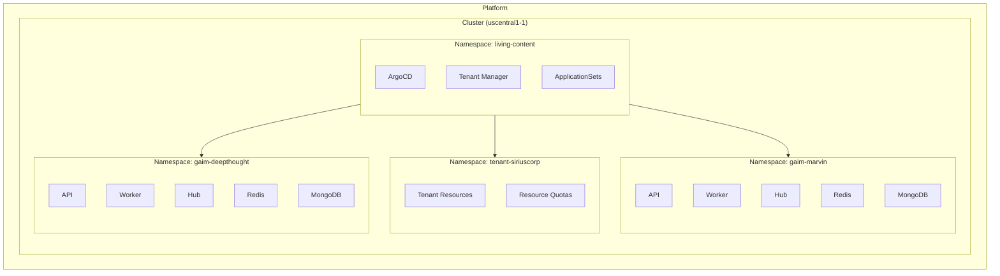
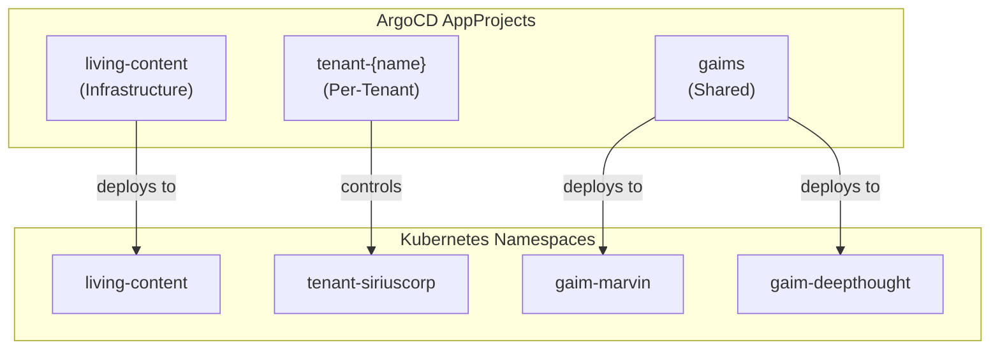
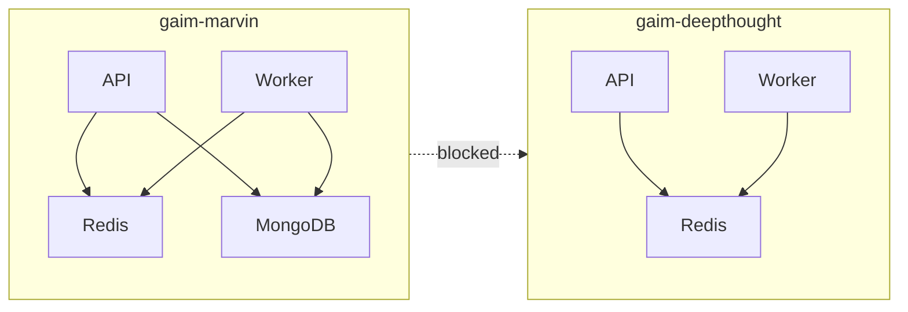
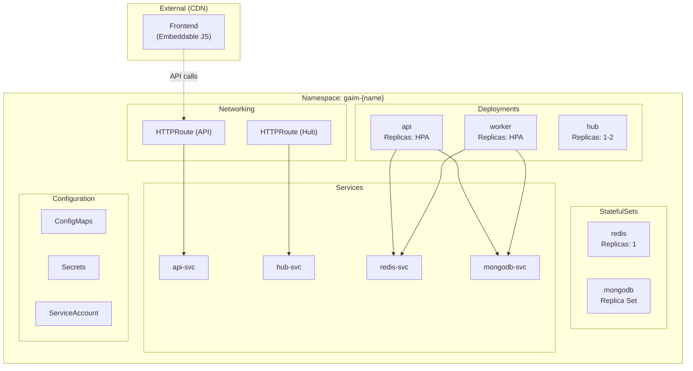
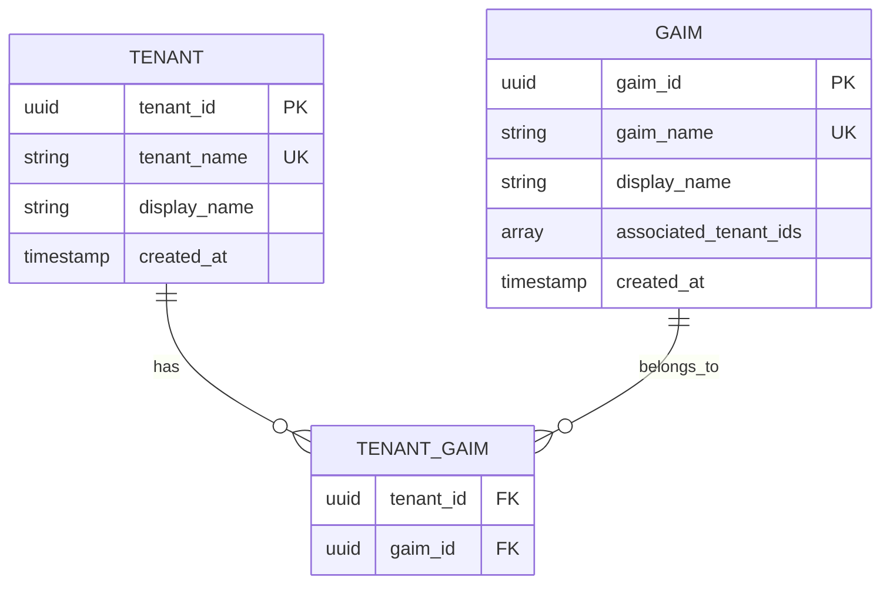
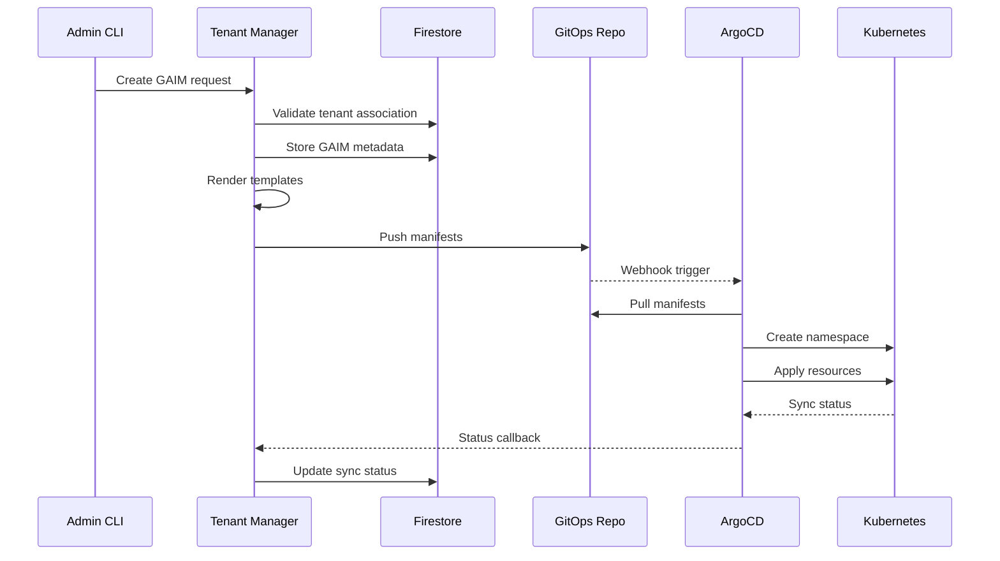

# Multi-Tenancy Model

Living Content implements a multi-tenant architecture with namespace-based
isolation, RBAC enforcement, and GitOps-driven provisioning.

## Tenancy Hierarchy



## Key Concepts

| Concept         | Description                                                |
| --------------- | ---------------------------------------------------------- |
| **Tenant**      | Top-level organizational unit that owns and manages GAIMs  |
| **GAIM**        | Deployable AI application instance (Generative AI Manager) |
| **AppProject**  | ArgoCD resource defining deployment access boundaries      |
| **Application** | ArgoCD resource that deploys actual workloads              |
| **Namespace**   | Kubernetes isolation unit                                  |

## Naming and Identification

### Dual Identifier Strategy

Each Tenant and GAIM has two identifiers:

| Identifier | Format                  | Usage                              |
| ---------- | ----------------------- | ---------------------------------- |
| **ID**     | UUID v4                 | Internal, permanent, database keys |
| **Name**   | `^[a-z][a-z0-9]{2,11}$` | Human-friendly, URLs, DNS, K8s     |

**Valid Name Examples:** `marvin`, `babelfish`, `heartofgold`

**Invalid Names:** `2fast` (starts with number), `ab` (too short),
`verylongname123` (too long)

### Namespace Naming

| Resource Type  | Pattern                | Example             |
| -------------- | ---------------------- | ------------------- |
| Infrastructure | `living-content`       | `living-content`    |
| Tenant         | `tenant-{tenant_name}` | `tenant-siriuscorp` |
| GAIM           | `gaim-{gaim_name}`     | `gaim-marvin`       |

### Cluster Naming

Pattern: `{region}-{cluster_index}`

Examples: `uscentral1-1`, `euwest1-2`, `useast1-1`

## AppProject Hierarchy

ArgoCD AppProjects define deployment permissions and resource boundaries.



### AppProject Types

| AppProject       | Scope      | Resources                                |
| ---------------- | ---------- | ---------------------------------------- |
| `living-content` | Platform   | ArgoCD, Tenant Manager, ApplicationSets  |
| `tenant-{name}`  | Per-tenant | Tenant-specific resources                |
| `gaims`          | All GAIMs  | GAIM deployments (API, Worker, Frontend) |

## Isolation Mechanisms

### Network Isolation

NetworkPolicies restrict cross-namespace communication:



### RBAC Isolation

AppProjects define deployment permissions:

- Which namespaces can be deployed to
- Which resources can be created
- Which source repositories are allowed

### Resource Isolation

Per-namespace limits via ResourceQuotas and LimitRanges:

| Resource | Quota                 |
| -------- | --------------------- |
| CPU      | Configurable per tier |
| Memory   | Configurable per tier |
| Pods     | Configurable per tier |
| PVCs     | Configurable per tier |

## GAIM Namespace Contents

Each GAIM namespace contains:



## Tenant-GAIM Association

GAIMs can be associated with multiple tenants:



## GitOps Directory Structure

```plaintext
living-content-gitops/
└── clusters/
    └── uscentral1-1/
        ├── infrastructure/
        │   ├── argocd/
        │   ├── tenant-manager/
        │   └── applicationsets/
        │
        ├── tenants/
        │   ├── tenant-siriuscorp/
        │   │   ├── namespace.yaml
        │   │   ├── resourcequota.yaml
        │   │   └── rolebindings.yaml
        │   │
        │   └── tenant-globex/
        │       └── ...
        │
        └── gaims/
            ├── gaim-marvin/
            │   ├── namespace.yaml
            │   ├── api-deployment.yaml
            │   ├── worker-deployment.yaml
            │   ├── hub-deployment.yaml
            │   ├── redis-statefulset.yaml
            │   ├── mongodb-statefulset.yaml
            │   ├── services.yaml
            │   └── httproutes.yaml
            │
            └── gaim-deepthought/
                └── ...
```

## ApplicationSet Discovery

### Tenant ApplicationSet

```yaml
apiVersion: argoproj.io/v1alpha1
kind: ApplicationSet
metadata:
  name: uscentral1-1-tenants
spec:
  generators:
    - git:
        repoURL: https://github.com/org/living-content-gitops
        revision: HEAD
        files:
          - path: clusters/uscentral1-1/tenants/*/namespace.yaml
  template:
    # Application template for each tenant
```

### GAIM ApplicationSet

```yaml
apiVersion: argoproj.io/v1alpha1
kind: ApplicationSet
metadata:
  name: uscentral1-1-gaims
spec:
  generators:
    - git:
        repoURL: https://github.com/org/living-content-gitops
        revision: HEAD
        directories:
          - path: clusters/uscentral1-1/gaims/*
  template:
    # Application template for each GAIM
```

## Provisioning Flow



## Multi-Cluster Considerations

- Same tenant/GAIM can exist across multiple clusters
- Firestore is shared across all clusters
- Each cluster has its own:
  - Tenant Manager instance
  - ArgoCD instance
  - ApplicationSets
  - Manifests directory (`clusters/{cluster}/`)

## Related Documentation

- [Platform Overview](platform-overview.md) - High-level architecture
- [Infrastructure Layer](infrastructure-layer.md) - Tenant Manager details
- [Networking](networking.md) - DNS and routing
- [Data Stores](data-stores.md) - Firestore collections
