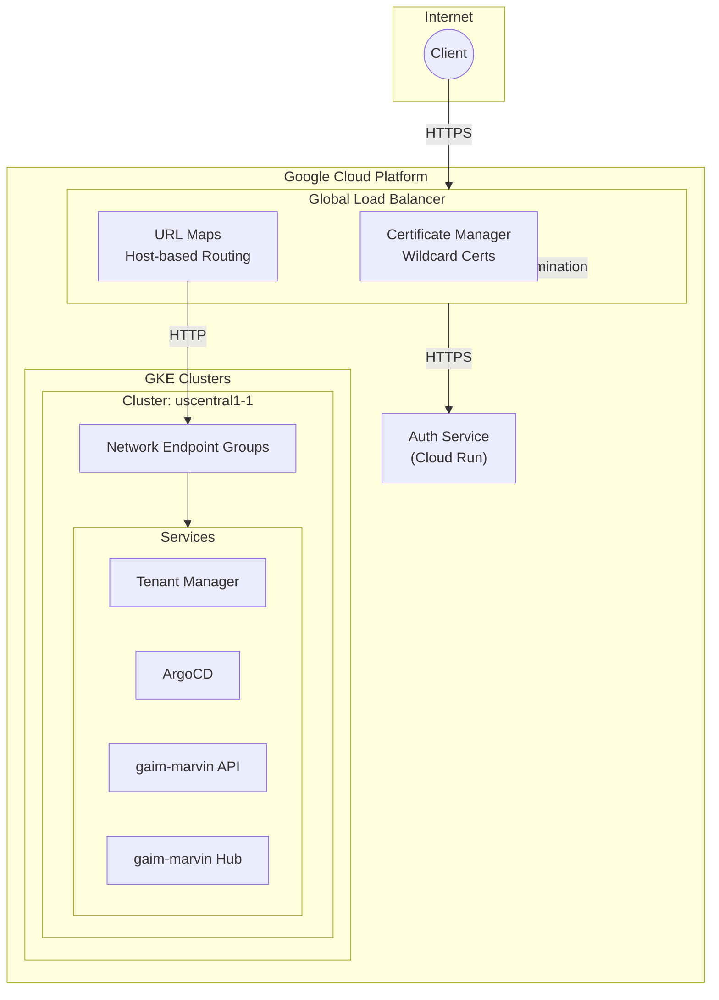
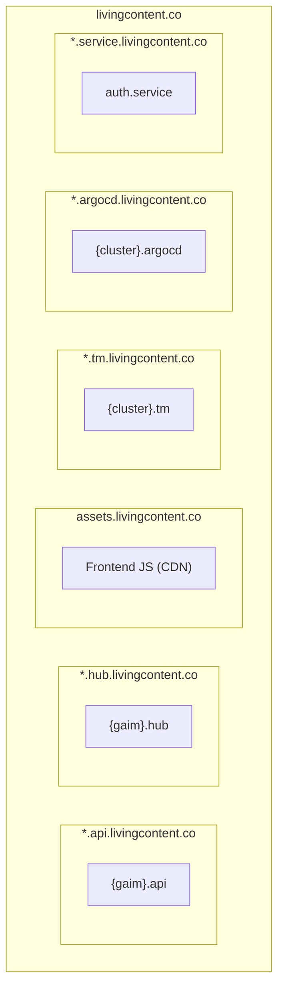
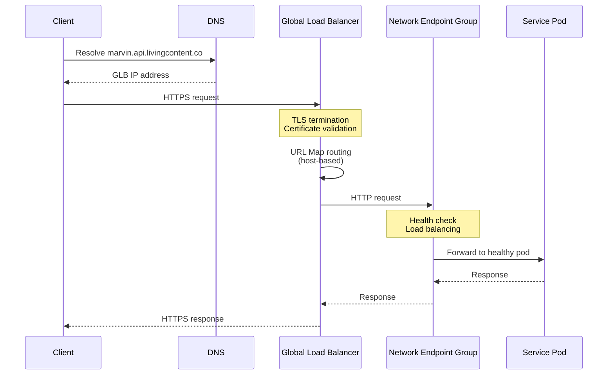
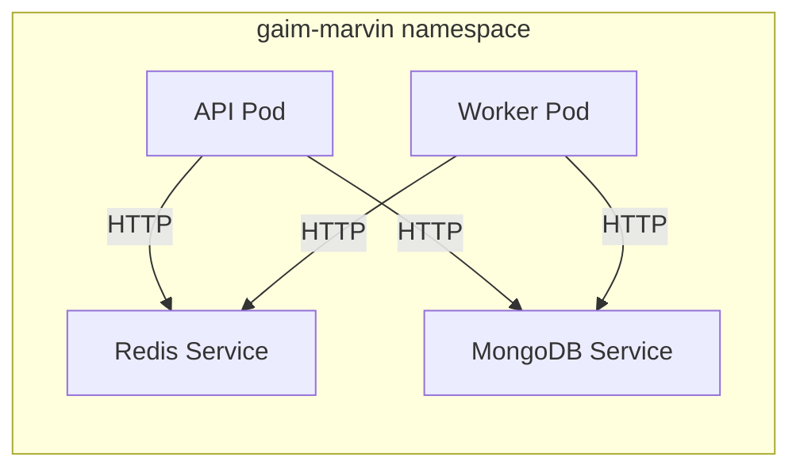
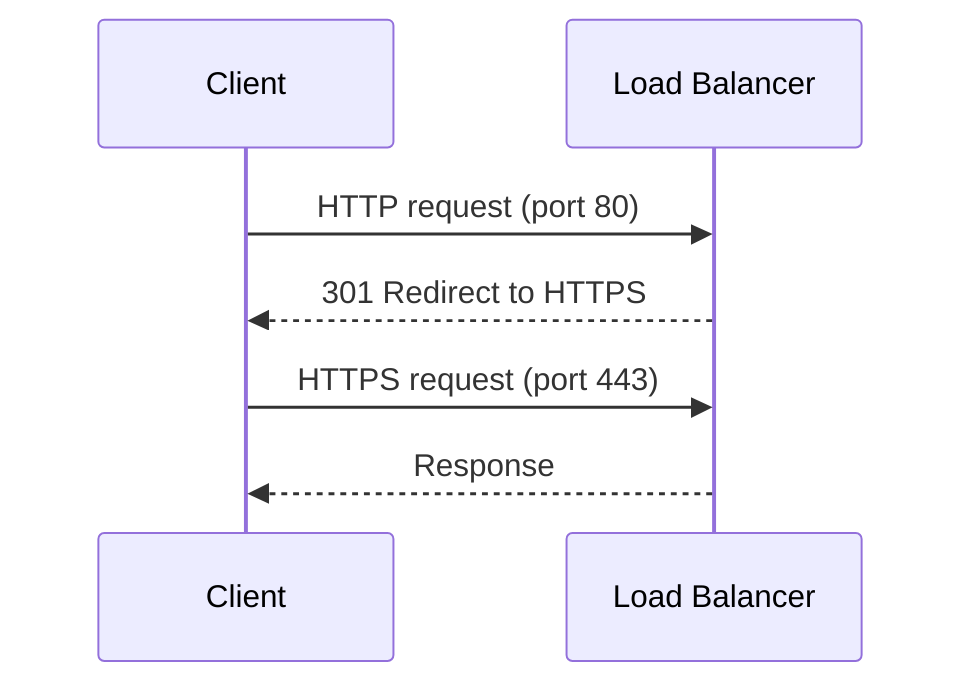
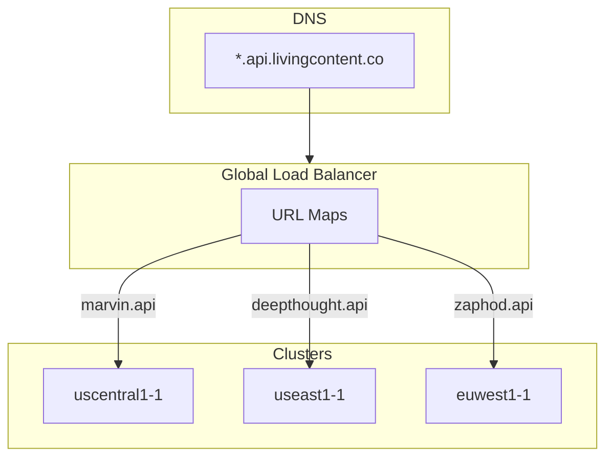
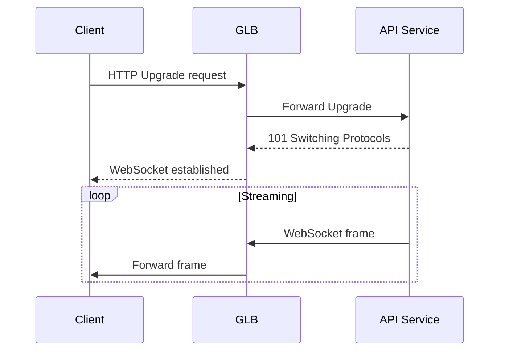

# Networking

Living Content uses Google Cloud's Gateway API with a Global Load Balancer for
traffic routing, TLS termination, and host-based routing to services across
clusters.

## Traffic Architecture



## DNS Patterns

### Nested Subdomain Structure



### Domain Patterns

| Service Type   | Pattern                             | Example                                |
| -------------- | ----------------------------------- | -------------------------------------- |
| GAIM API       | `{gaim}.api.livingcontent.co`       | `marvin.api.livingcontent.co`          |
| GAIM Hub       | `{gaim}.hub.livingcontent.co`       | `marvin.hub.livingcontent.co`          |
| Frontend JS    | `assets.livingcontent.co`           | CDN-hosted embeddable JS               |
| Tenant Manager | `{cluster}.tm.livingcontent.co`     | `uscentral1-1.tm.livingcontent.co`     |
| ArgoCD         | `{cluster}.argocd.livingcontent.co` | `uscentral1-1.argocd.livingcontent.co` |
| Auth Service   | `auth.service.livingcontent.co`     | -                                      |

## Wildcard Certificates

Managed via Google Certificate Manager with DNS authorization.

| Certificate                  | Domain                      | Purpose          |
| ---------------------------- | --------------------------- | ---------------- |
| `living-content-cert`        | `*.livingcontent.co`        | Root wildcard    |
| `living-content-api-cert`    | `*.api.livingcontent.co`    | GAIM APIs        |
| `living-content-hub-cert`    | `*.hub.livingcontent.co`    | GAIM Hubs        |
| `living-content-assets-cert` | `assets.livingcontent.co`   | Frontend CDN     |
| `living-content-tm-cert`     | `*.tm.livingcontent.co`     | Tenant Managers  |
| `living-content-argocd-cert` | `*.argocd.livingcontent.co` | ArgoCD instances |

## Gateway API Configuration

### Gateway Resource

```yaml
apiVersion: gateway.networking.k8s.io/v1
kind: Gateway
metadata:
  name: external-gateway
  namespace: living-content
spec:
  gatewayClassName: gke-l7-global-external-managed
  addresses:
    - type: NamedAddress
      value: living-content-global-ip
  listeners:
    - name: https-api
      hostname: '*.api.livingcontent.co'
      port: 443
      protocol: HTTPS
      tls:
        mode: Terminate
        certificateRefs:
          - name: living-content-api-cert
    - name: https-hub
      hostname: '*.hub.livingcontent.co'
      port: 443
      protocol: HTTPS
      tls:
        mode: Terminate
        certificateRefs:
          - name: living-content-hub-cert
```

### HTTPRoute Resource (GAIM API)

```yaml
apiVersion: gateway.networking.k8s.io/v1
kind: HTTPRoute
metadata:
  name: gaim-marvin-api
  namespace: gaim-marvin
spec:
  parentRefs:
    - name: external-gateway
      namespace: living-content
      sectionName: https-api
  hostnames:
    - 'marvin.api.livingcontent.co'
  rules:
    - backendRefs:
        - name: api-svc
          port: 8000
```

## Traffic Flow

### Request Path



### Internal Traffic

Within the cluster, traffic flows over HTTP (TLS terminates at GLB):



## Load Balancing

### Global Load Balancer Features

| Feature          | Configuration                     |
| ---------------- | --------------------------------- |
| Protocol         | HTTPS (external), HTTP (internal) |
| SSL Policy       | Modern ciphers only               |
| HTTP/2           | Enabled                           |
| Session Affinity | None (stateless)                  |
| Health Checks    | HTTP `/health` endpoint           |

### Network Endpoint Groups (NEGs)

NEGs provide direct pod-level load balancing:

- Auto-created by GKE Gateway controller
- Pod IP addresses registered directly
- Bypass kube-proxy for reduced latency
- Health checks per-pod

### Health Checks

| Endpoint      | Interval   | Threshold |
| ------------- | ---------- | --------- |
| API `/health` | Configured | Threshold |
| Hub `/`       | Configured | Threshold |
| TM `/health`  | Configured | Threshold |

## Rate Limiting

Implemented via Cloud Armor security policies at the GLB.

### Default Limits

| Endpoint        | Rate Limit      |
| --------------- | --------------- |
| Auth endpoints  | Restricted      |
| Query endpoints | Per-user limits |
| Default         | Standard        |

### Cloud Armor Policy

```yaml
securityPolicy:
  rules:
    - action: rate_based_ban
      match:
        expr:
          expression: "request.path.matches('/auth/init')"
      rateLimitOptions:
        rateLimitThreshold:
          count: 5
          intervalSec: 1
```

## HTTP to HTTPS Redirect

All HTTP traffic is redirected to HTTPS:



## Multi-Cluster Routing



Each GAIM's HTTPRoute specifies which cluster handles its traffic. Future
multi-region GAIMs could use weighted routing.

## WebSocket Support

WebSocket connections for real-time streaming:



### WebSocket Configuration

| Parameter      | Value                  |
| -------------- | ---------------------- |
| Timeout        | Extended for streaming |
| Ping Interval  | Configured             |
| Max Frame Size | 64KB                   |

## Related Documentation

- [Platform Overview](platform-overview.md) - Architecture context
- [Infrastructure Layer](infrastructure-layer.md) - GLB setup
- [Application Layer](application-layer.md) - Service endpoints
- [Authentication](authentication.md) - Auth service routing
