# Observability

Living Content implements comprehensive observability through Prometheus
metrics, structured logging, health checks, and resilience patterns.

## Observability Architecture

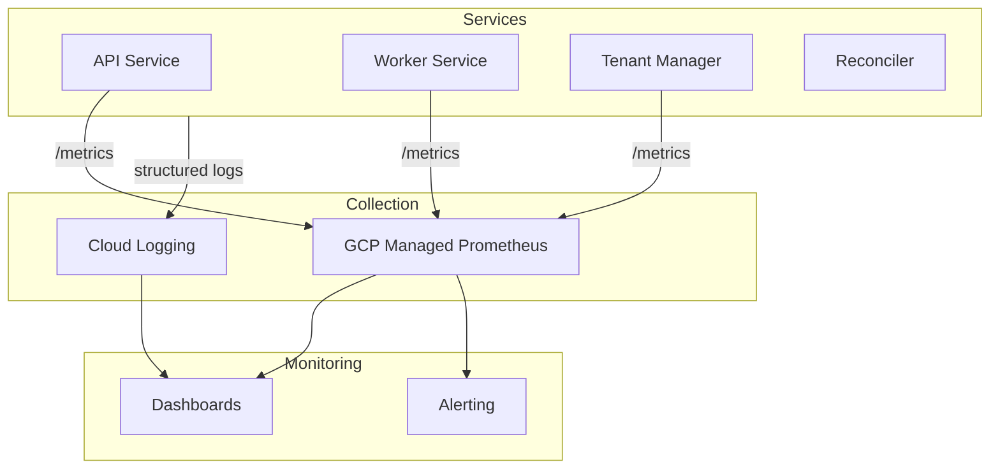

## Prometheus Metrics

### Metric Collection

PodMonitor resources enable automatic metric scraping.

```yaml
apiVersion: monitoring.coreos.com/v1
kind: PodMonitor
metadata:
  name: gaim-api
  namespace: gaim-marvin
spec:
  selector:
    matchLabels:
      app: api
  podMetricsEndpoints:
    - port: metrics
      interval: { configured }
```

### Metric Categories

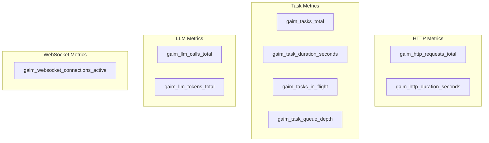

### Metric Reference

| Metric                              | Type      | Labels               | Description                  |
| ----------------------------------- | --------- | -------------------- | ---------------------------- |
| `gaim_http_requests_total`          | Counter   | method, path, status | HTTP request count           |
| `gaim_http_duration_seconds`        | Histogram | method, path         | Request latency              |
| `gaim_tasks_total`                  | Counter   | task_name, status    | Task execution count         |
| `gaim_task_duration_seconds`        | Histogram | task_name            | Task latency                 |
| `gaim_tasks_in_flight`              | Gauge     | task_name            | Currently executing tasks    |
| `gaim_task_queue_depth`             | Gauge     | -                    | Pending tasks in queue       |
| `gaim_llm_calls_total`              | Counter   | model, provider      | LLM API calls                |
| `gaim_llm_tokens_total`             | Counter   | model, direction     | Token usage (input/output)   |
| `gaim_websocket_connections_active` | Gauge     | -                    | Active WebSocket connections |

### Auto-Added Labels

GCP Managed Prometheus automatically adds:

- `namespace`
- `pod`
- `cluster`
- `location`

## Health Checks

### Endpoint Structure

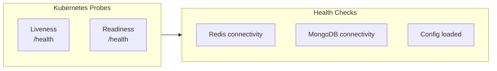

### API Health Endpoint

```json
GET /health

{
  "status": "healthy",
  "checks": {
    "redis": "ok",
    "mongodb": "ok",
    "config": "loaded"
  },
  "version": "1.2.3"
}
```

### Worker Health Check

File-based heartbeat for worker processes:

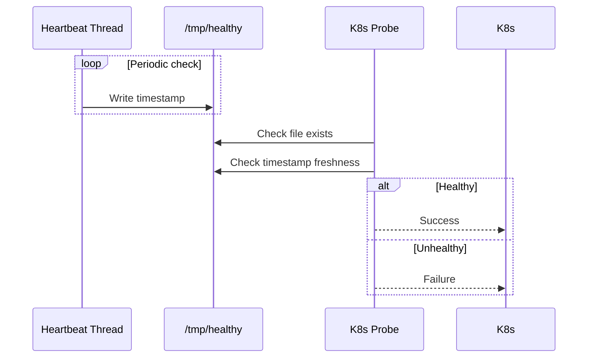

### Probe Configuration

| Probe            | Endpoint   | Type |
| ---------------- | ---------- | ---- |
| API Liveness     | `/health`  | HTTP |
| API Readiness    | `/health`  | HTTP |
| Worker Liveness  | File check | File |
| Worker Readiness | File check | File |

## Resilience Patterns

### Pattern Overview

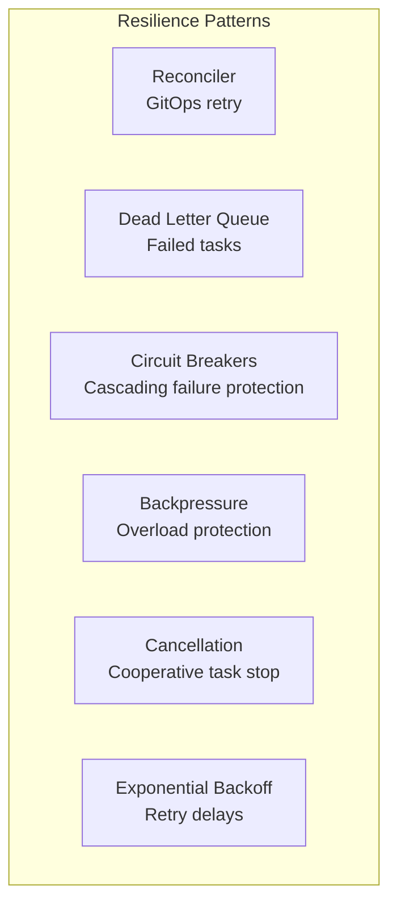

### Reconciler

Automatic retry of failed GitOps syncs.

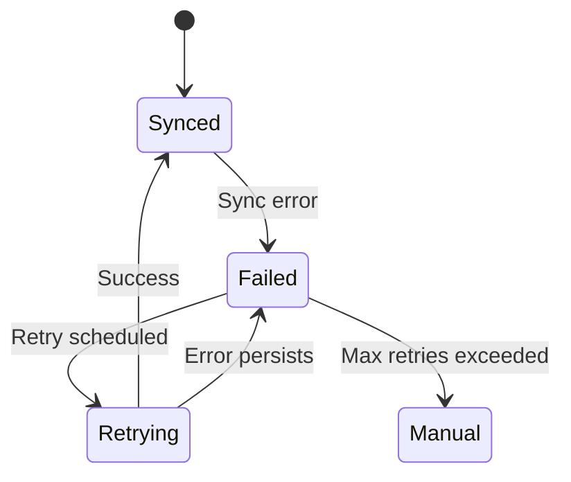

**Retry Schedule:**

Uses exponential backoff with jitter, capped at a maximum delay.

### Dead Letter Queue

Failed tasks after maximum retries.

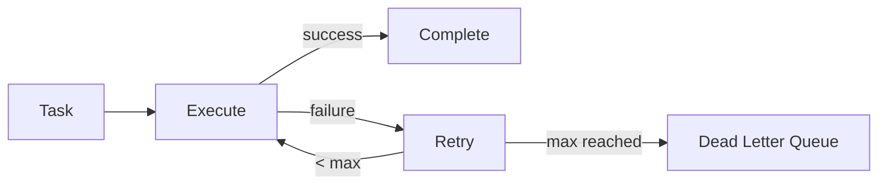

**DLQ Entry:**

```json
{
  "task_name": "process_query",
  "task_id": "task-123",
  "args": { ... },
  "error": "Tool execution timeout",
  "timestamp": "2024-01-22T16:35:00Z",
  "retry_count": 3
}
```

### Circuit Breakers

Redis-backed distributed circuit breaker.

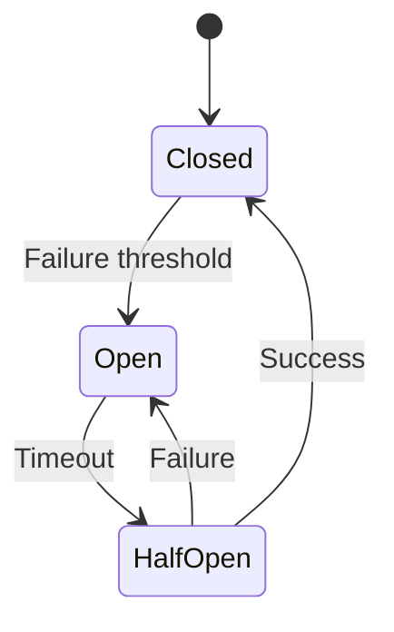

| State         | Behavior                         |
| ------------- | -------------------------------- |
| **Closed**    | Normal operation, count failures |
| **Open**      | Reject requests immediately      |
| **Half-Open** | Allow limited requests to test   |

### Backpressure Control

Queue depth monitoring with request rejection.

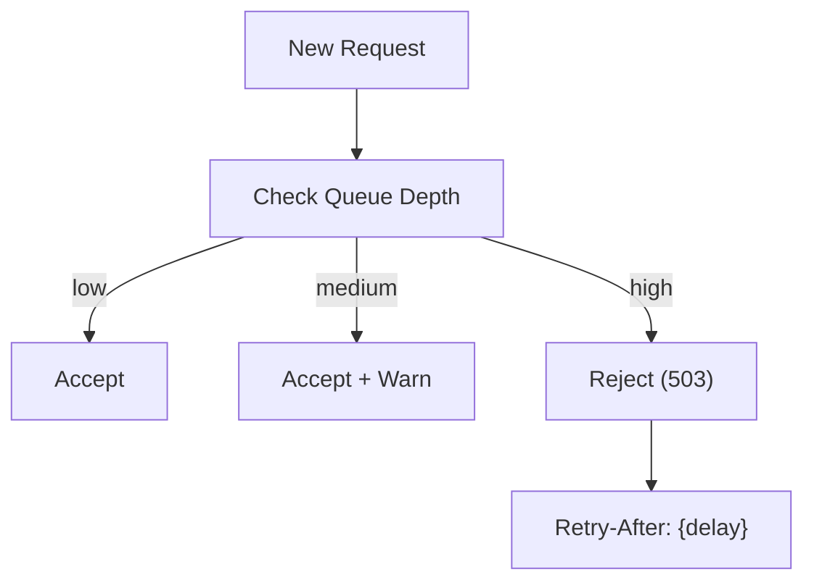

| Threshold | Action                        |
| --------- | ----------------------------- |
| Low       | Normal processing             |
| Medium    | Accept with warning log       |
| High      | Reject with 503 + Retry-After |

### Cooperative Cancellation

Task cancellation via CancellationToken.

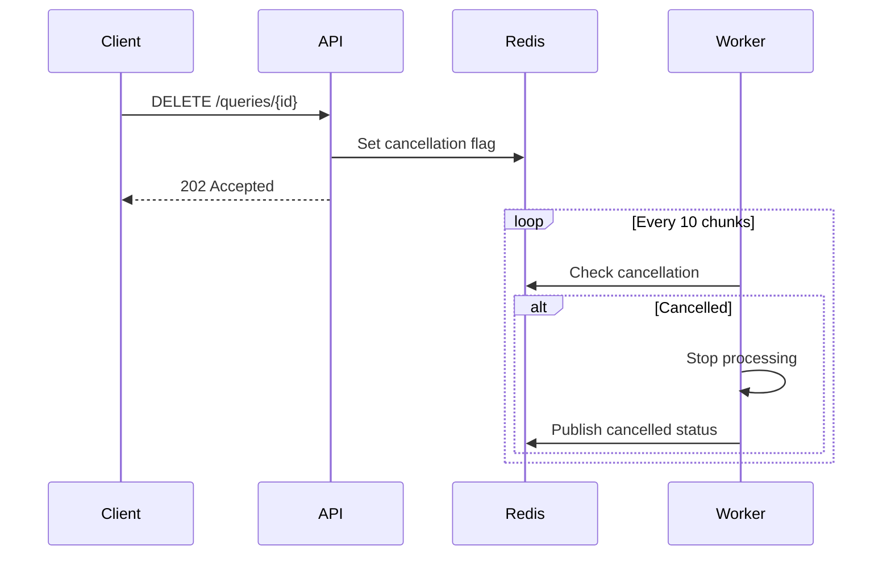

### Backoff Tracker

Infrastructure failure handling with adaptive backoff.

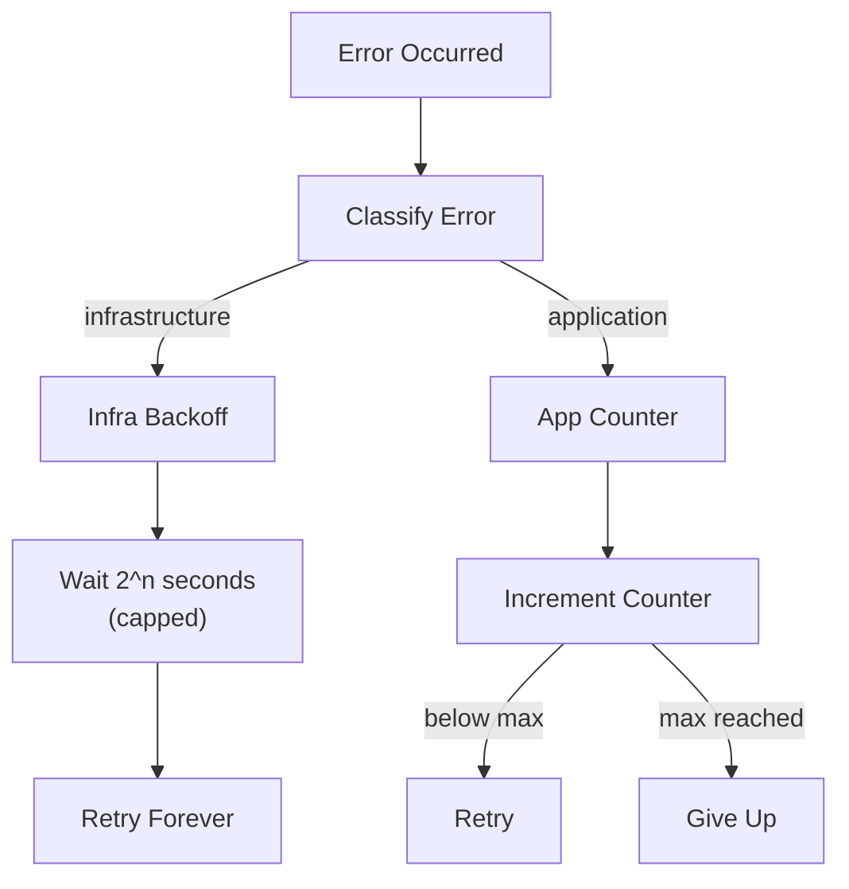

| Error Type     | Behavior                           |
| -------------- | ---------------------------------- |
| Infrastructure | Exponential backoff, never give up |
| Application    | Count failures, give up after 10   |

## Logging

### Structured Logging

JSON-formatted logs for Cloud Logging integration.

```json
{
  "severity": "INFO",
  "message": "Query processed",
  "timestamp": "2024-01-22T16:30:00.123Z",
  "trace": "projects/xxx/traces/dontpanic42",
  "labels": {
    "gaim_id": "660e8400-...",
    "user_id": "dent42",
    "request_id": "req-456"
  },
  "httpRequest": {
    "requestMethod": "POST",
    "requestUrl": "/queries",
    "status": 200,
    "latency": "0.234s"
  }
}
```

### Log Levels

| Level    | Usage                        |
| -------- | ---------------------------- |
| DEBUG    | Detailed debugging info      |
| INFO     | Normal operations            |
| WARNING  | Potential issues             |
| ERROR    | Failures requiring attention |
| CRITICAL | System-level failures        |

### Correlation

Request tracing across services:

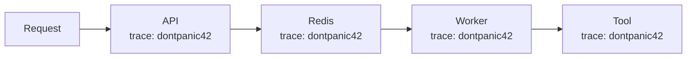

## Infrastructure Health Monitor

Coordinates health checking across worker tasks.

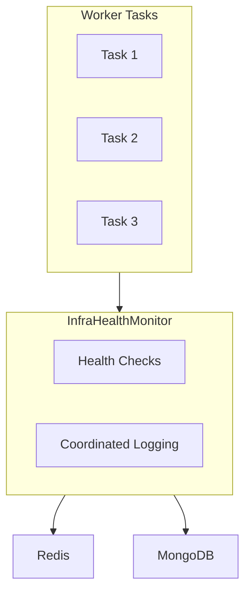

| Feature              | Description                       |
| -------------------- | --------------------------------- |
| Deduplication        | One log per failure, not per task |
| Recovery Detection   | Log when service recovers         |
| Backoff Coordination | Shared backoff state              |

## Queue Monitoring

### Queue Status Endpoint

```json
GET /system/queue

{
  "status": "healthy",
  "depth": 42,
  "consumers": 5,
  "oldest_message_age_seconds": 2.3,
  "processed_last_minute": 156,
  "failed_last_minute": 2
}
```

### Queue Alerts

| Condition            | Alert    |
| -------------------- | -------- |
| Depth elevated       | Warning  |
| Depth high           | Critical |
| Message age warning  | Warning  |
| Message age critical | Critical |
| No consumers         | Critical |

## Dashboard Recommendations

### Key Panels

1. **Request Rate** - `rate(gaim_http_requests_total[5m])`
2. **Error Rate** - `rate(gaim_http_requests_total{status=~"5.."}[5m])`
3. **Latency P95** - `histogram_quantile(0.95, gaim_http_duration_seconds)`
4. **Queue Depth** - `gaim_task_queue_depth`
5. **Active Connections** - `gaim_websocket_connections_active`
6. **LLM Token Usage** - `rate(gaim_llm_tokens_total[1h])`

### SLO Targets

| Metric       | Target             |
| ------------ | ------------------ |
| Availability | 99.9%              |
| Latency P95  | Within SLO targets |
| Error Rate   | < 0.1%             |
| Queue Depth  | Within threshold   |

## Related Documentation

- [Platform Overview](platform-overview.md) - Architecture context
- [Application Layer](application-layer.md) - Service metrics
- [Infrastructure Layer](infrastructure-layer.md) - Reconciler details
- [Data Stores](data-stores.md) - Redis queue details
