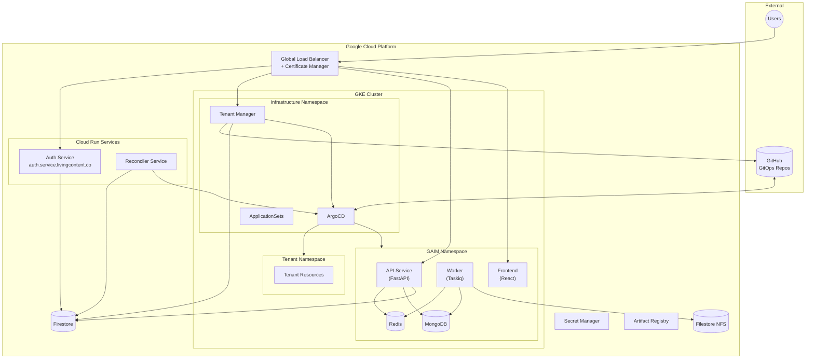
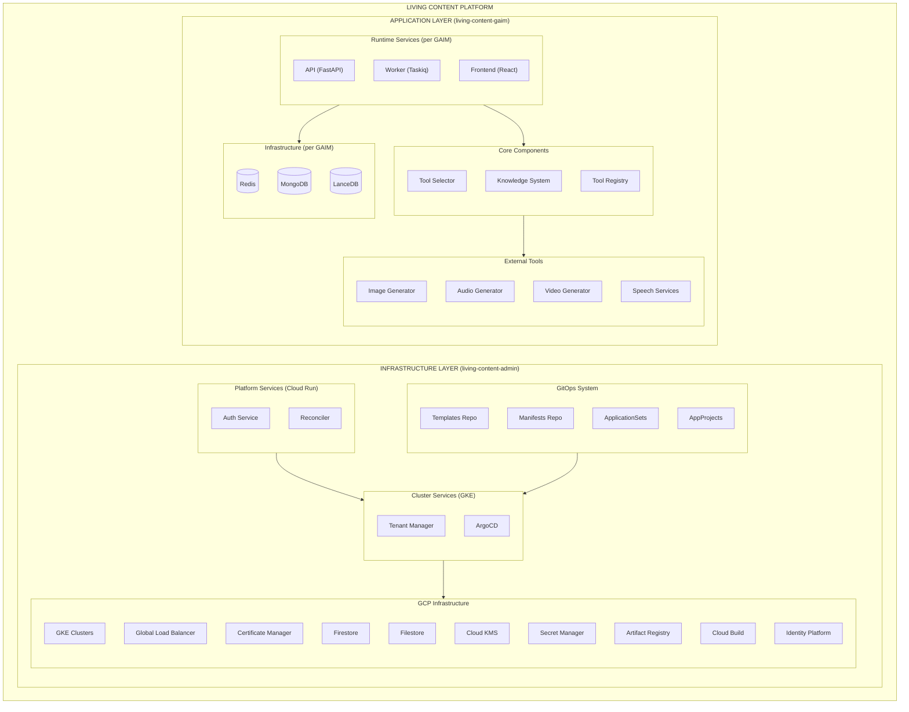
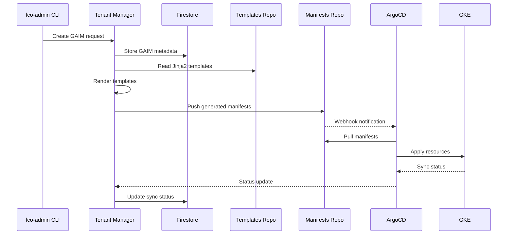
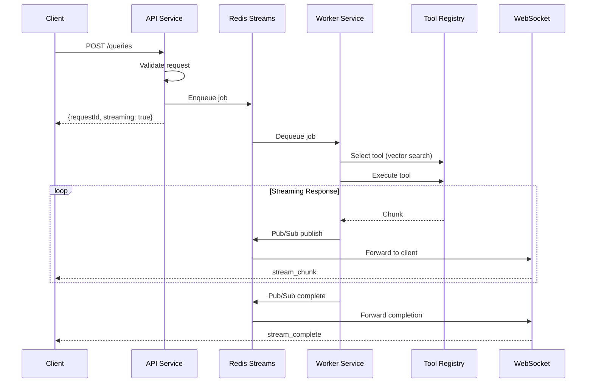

# Platform Overview

## System Architecture

Living Content is a GitOps-driven multi-tenant AI infrastructure platform
providing automated provisioning, deployment, and management for isolated tenant
environments.

## Component Hierarchy

## Data Flow

### GitOps Deployment Flow

### Query Processing Flow

## Technology Stack

| Layer                       | Component            | Technology                           |
| --------------------------- | -------------------- | ------------------------------------ |
| **Cloud Platform**          | Infrastructure       | Google Cloud Platform                |
| **Container Orchestration** | Runtime              | Google Kubernetes Engine (GKE)       |
| **Load Balancing**          | Traffic              | Gateway API + Global Load Balancer   |
| **GitOps**                  | Deployment           | ArgoCD + ApplicationSets             |
| **Serverless**              | Platform Services    | Cloud Run                            |
| **Database**                | Metadata/Config      | Firestore                            |
| **Hub**                     | Tenant Management UI | Vanilla JS (GKE)                     |
| **Frontend**                | User-facing UI       | Vanilla JS (Embeddable, Event-based) |
| **Database**                | Application Data     | MongoDB                              |
| **Cache/Queue**             | Messaging            | Redis (Streams + Pub/Sub)            |
| **Vector Store**            | Embeddings           | LanceDB                              |
| **File Storage**            | RAG Data             | Filestore (NFS)                      |
| **Secrets**                 | Credentials          | Secret Manager + KMS                 |
| **Auth**                    | Identity             | Identity Platform                    |
| **Registry**                | Images               | Artifact Registry                    |
| **CI/CD**                   | Builds               | Cloud Build                          |

## Design Principles

1. **GitOps-First**: All infrastructure changes flow through Git → ArgoCD
2. **Multi-Tenant Isolation**: Namespace-based with RBAC enforcement
3. **UUID/Name Duality**: Permanent IDs with human-friendly names
4. **Eventual Consistency**: Reconciler handles sync convergence
5. **Level-Triggered Controllers**: Kubernetes-style control loops
6. **Fail-Safe Defaults**: Rate limiting, backoff, manual intervention
7. **Security-First**: Workload Identity, Secret Manager, encrypted storage
8. **Observability**: Comprehensive logging, metrics, and status tracking

## Related Documentation

- [Infrastructure Layer](infrastructure-layer.md) - Platform management details
- [Application Layer](application-layer.md) - GAIM runtime components
- [Multi-Tenancy](multi-tenancy.md) - Isolation and namespace model
- [Networking](networking.md) - Traffic routing and DNS
